# porthole · 舷窗

> 一個 path-scoped 的 web 介面,讓你透過瀏覽器跟住在各 repo 裡的 agent(`claude -p`)高效溝通。
> A path-scoped web GUI to talk to the coding agents living in your repos — through the browser.

仿 Obsidian / VSCode 的三欄佈局:左邊看檔案樹、中間編輯檔、右邊跟 agent 對話或開終端 —— 三者同框,**邊改檔邊對話**。

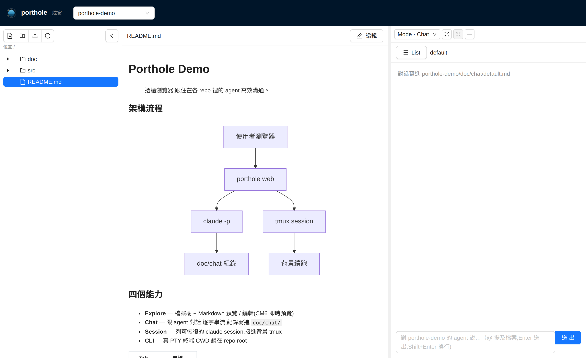

---

## 它能做什麼

- **Explore** — 檔案樹 + Markdown 即時預覽 / 編輯(CodeMirror 6,Obsidian 式 live-preview,內嵌 mermaid 互動圖)。依所在目錄新增檔 / 目錄、上傳檔案。
- **Chat** — 跟 active repo 的 agent 對話,`claude -p` 逐字串流,紀錄寫進 `doc/chat/`。
- **Session** — 列出可恢復的 claude session,點一個接進背景 `tmux`(detach 後背景續跑)。
- **CLI** — 真 PTY 終端,CWD 鎖在 repo root。

右側面板可切 Chat / Session / CLI,且**保活不卸載**(切走不斷終端);可拖寬、撐滿覆蓋中央、或最小化到右緣。

| 編輯(CM6 即時預覽 + mermaid 互動 box) | 終端(CLI / Session) |
|---|---|
| 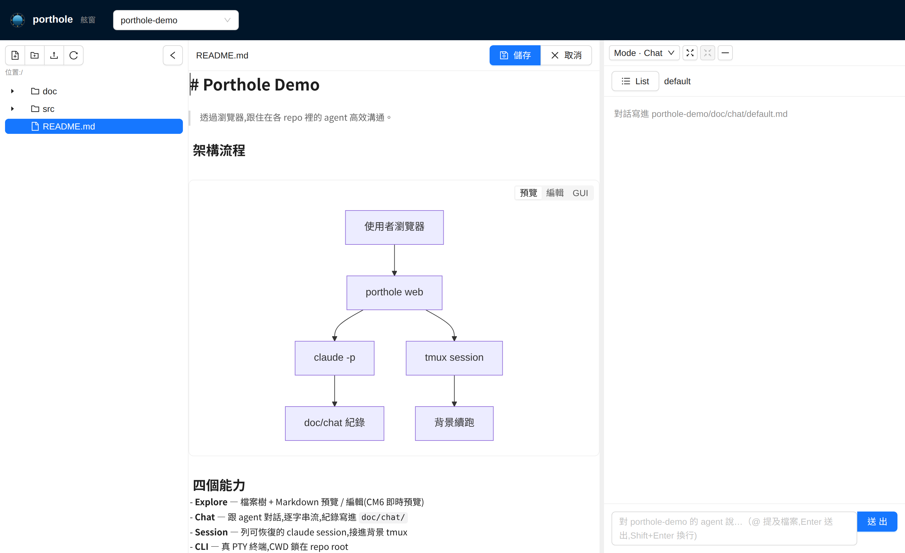 | 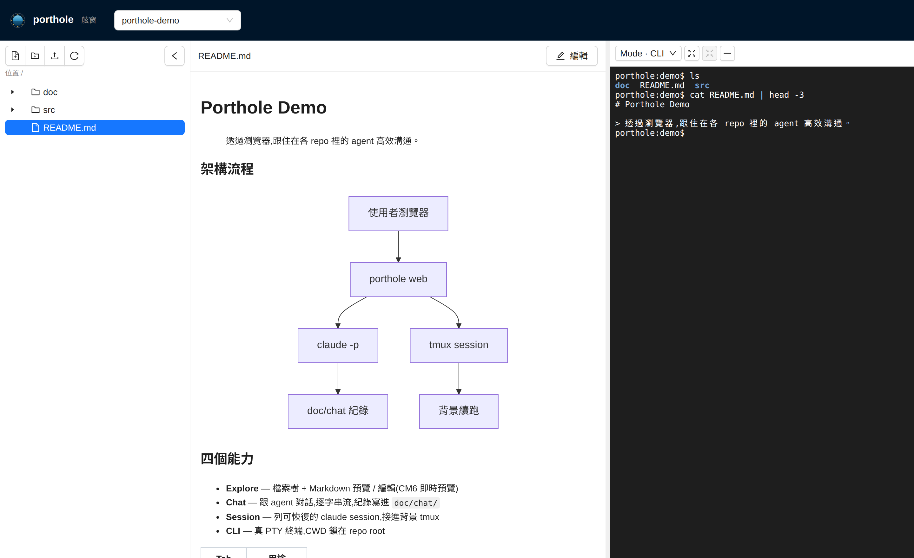 |

---

## mermaid 圖表 GUI 編輯

編輯 Markdown 時,每個 ```mermaid 區塊都有 **GUI** tab,可圖形化編輯後正規化寫回(空白行右鍵也能一鍵插入各圖型範例)。節點圖型用 React Flow + dagre 自動排版,共用雙擊改字 / 拖把手連線 / Delete 刪 / 復原重做 / 複製貼上 / 全螢幕;sequence 則是清單式表單。支援 7 種圖型:

| Flowchart | State diagram |
|---|---|
| 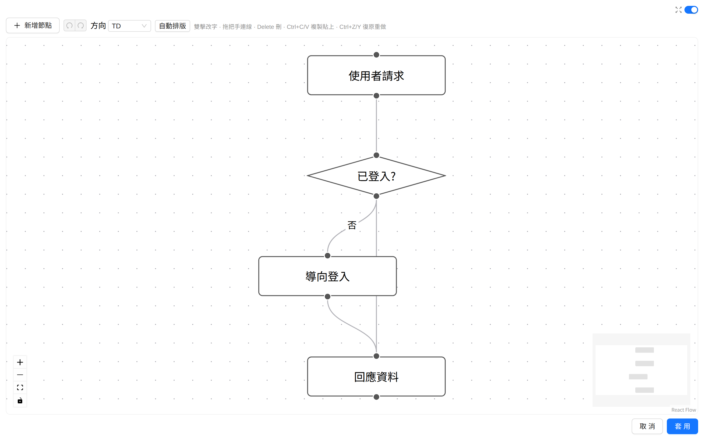 | 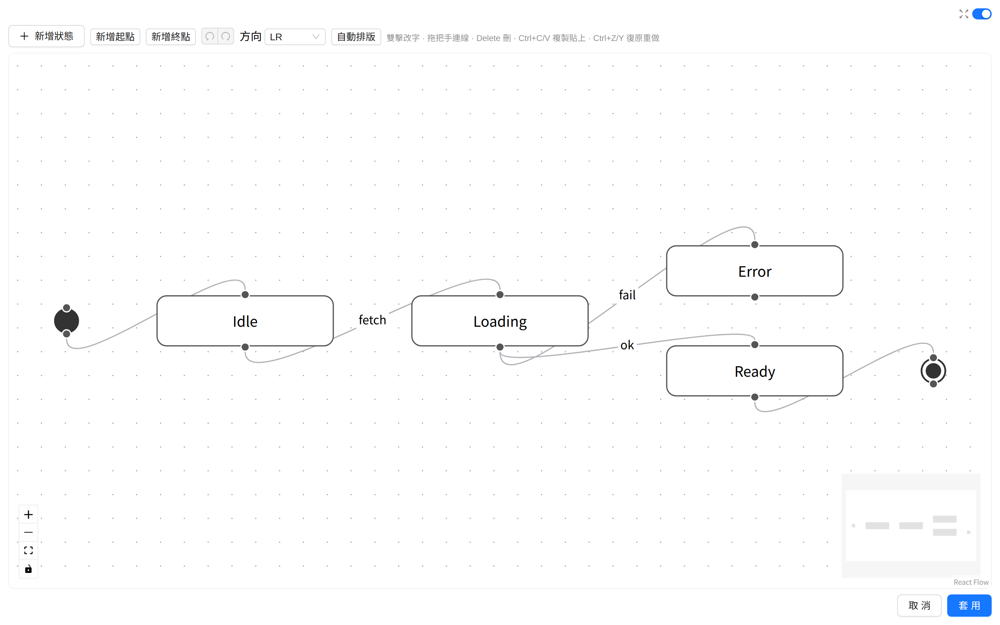 |

| ERD | Class diagram |
|---|---|
| 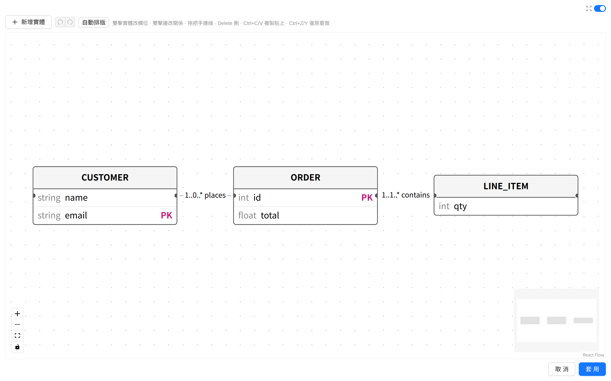 | 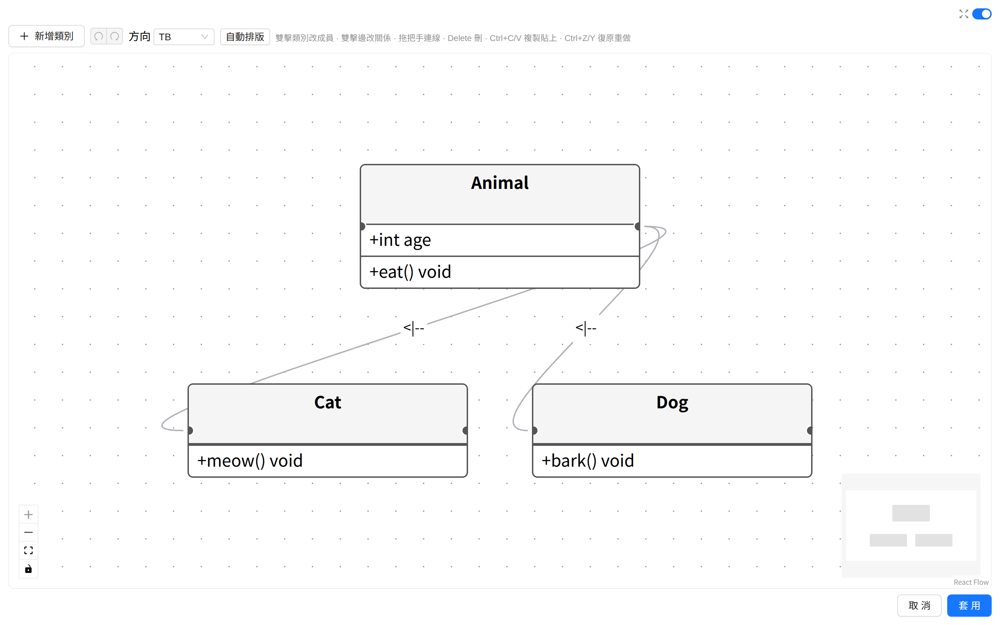 |

| Sequence diagram(清單式) | Architecture |
|---|---|
| 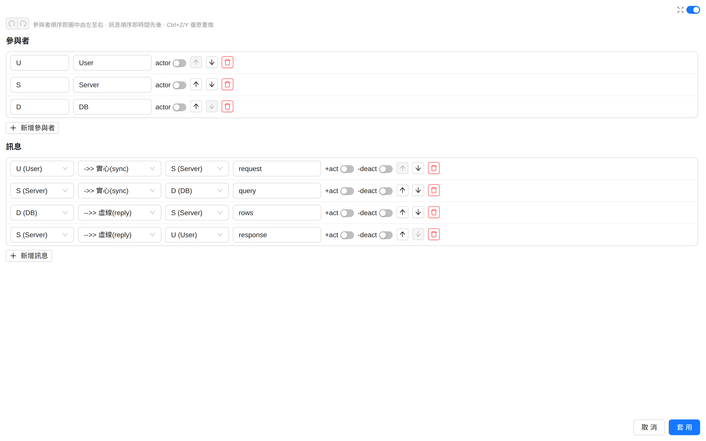 | 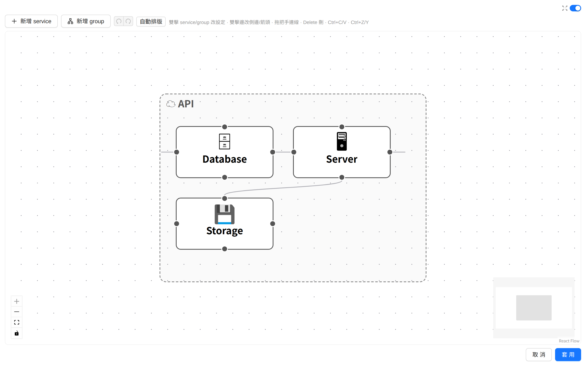 |

| Mind map(樹狀:新增子/兄弟、形狀、icon;拖線改 parent) |
|---|
| 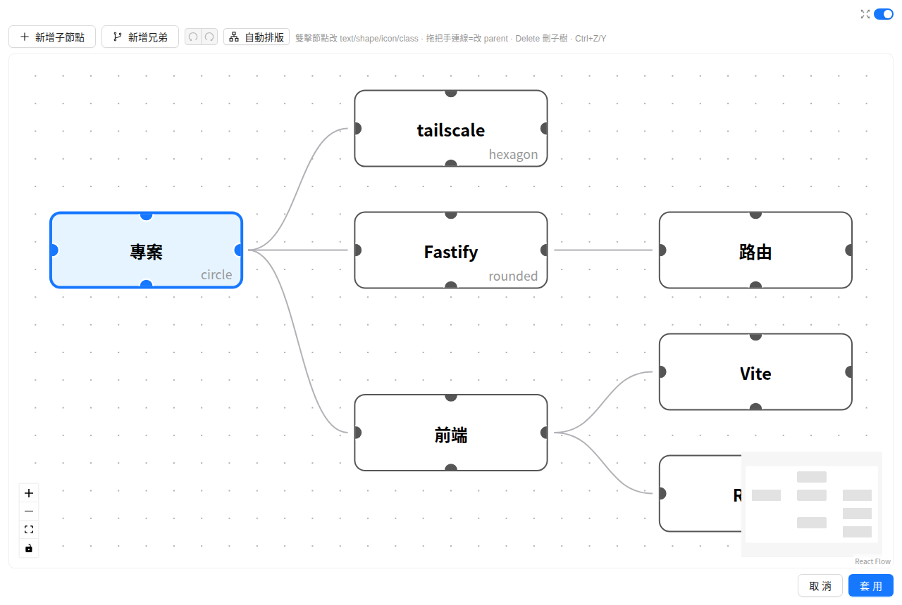 |

各圖型僅支援其常用子集(subgraph / composite state / loop/alt 等退回純文字編輯)。

---

## D2 架構圖

` ```d2 ` 區塊用 [D2](https://d2lang.com) 繪製架構圖(C4 風格:container 為一等公民)。D2 原生支援「**容器對容器**」的邊——這是 mermaid architecture-beta 做不到的(它的 group 不能當邊端點)。GUI 編輯器(React Flow)裡 container 與 shape 四邊都有接點,直接拖就能連;下圖那條「容器對容器」就是從一個容器框邊連到另一個容器框邊:

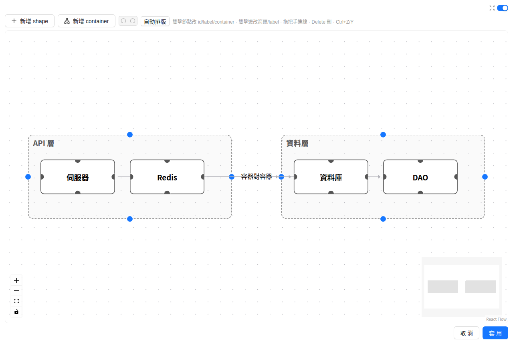

渲染走後端 shell out `d2` CLI(前端只收 SVG)。需在 host 安裝 d2 並於 `.env` 設 `D2_BIN`(預設吃 PATH);沒裝不影響其他功能。安裝見 [d2lang.com](https://d2lang.com/tour/install)。

---

## 安全模型(請先讀)

porthole 預設只給**單機自用 + 信任網路**。請務必理解:

- **無認證**。CLI / Session 是完整 PTY,等同**以執行身分的完整 RCE**;path guard 只鎖 fs 讀寫與子程序 CWD,不限制終端能跑什麼。
- **path guard**(安全命脈):所有 fs 讀寫、claude/tmux 的 CWD 一律 `realpath` 正規化後驗證仍落在 basePath 內,`..` / symlink 逃逸即 **403**。靠 code 擋,不靠 prompt。
- **WS 同源檢查** 擋 CSWSH(跨站網頁連本機 WS 拿 shell);綁 `127.0.0.1` 也擋不住,故此檢查不可少。
- **綁定**:預設 `127.0.0.1`。要遠端用,建議綁 **tailscale 網卡 IP**(只 tailnet 可達)。**不要綁 `0.0.0.0`** —— 那會連同整個 LAN 一起開放。

> 一句話:這是「給自己用的遠端終端」,不是多人服務。只在你完全信任的網路裡跑。細節見 [`doc/SPEC.md`](doc/SPEC.md) §2。

---

## 快速開始

```bash
git clone https://github.com/kirinchen/porthole.git
cd porthole
npm install && npm run install:all   # 根層工具 + server/web 依賴

cp .env.example .env                 # 設定:HOST / PORT / PORTHOLE_BASE
# 編輯 .env:PORTHOLE_BASE 指向你放各 repo 的母目錄

npm run dev                          # 開發(前後端分離 + 熱更新)
# 或
npm run prod                         # 建置前端 + 單 port 4321 serve
```

瀏覽器開 `http://<host>:<port>/<repo>` —— URL 第一段 = active repo(如 `/myproject`)。

常駐部署(systemd user service)見 [`RUN.md`](RUN.md) 與 [`deploy/`](deploy/)。

---

## 技術

- 前端:Vite + React 19 + TypeScript(strict)+ Antd 6 + CodeMirror 6 + xterm.js
- 後端:Fastify(單 port,serve build + REST/SSE + WebSocket + path 映射)
- 終端:`node-pty` + `tmux`;LLM:shell out 到 `claude -p`(不整合 SDK)

設計原則:安全邊界優先、deterministic-first、LLM as Unix tool、薄。

---

## 文件

- [`doc/SPEC.md`](doc/SPEC.md) — 規格 SSoT(安全、四能力、佈局、驗收)
- [`RUN.md`](RUN.md) — 啟動 / 部署
- [`CLAUDE.md`](CLAUDE.md) — 開發指引
